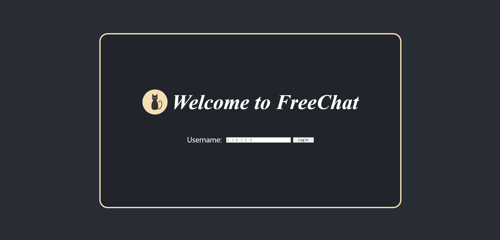
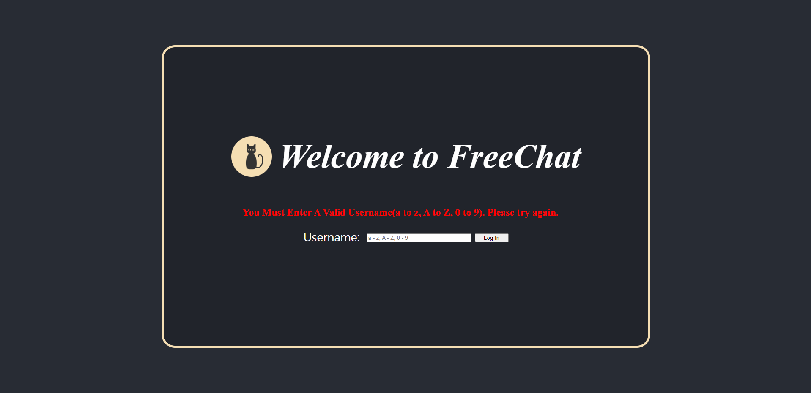
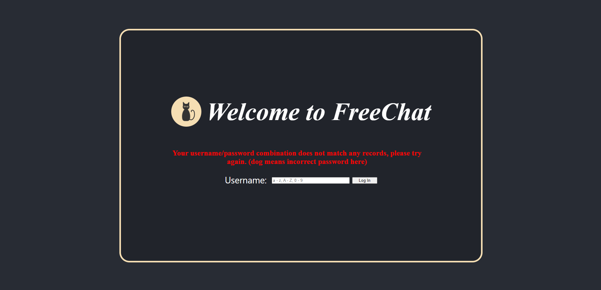
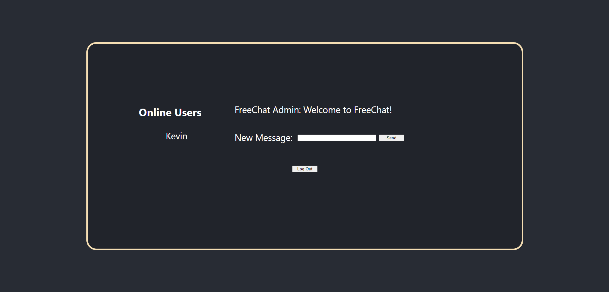
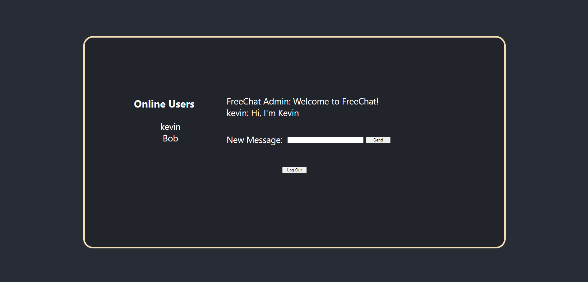
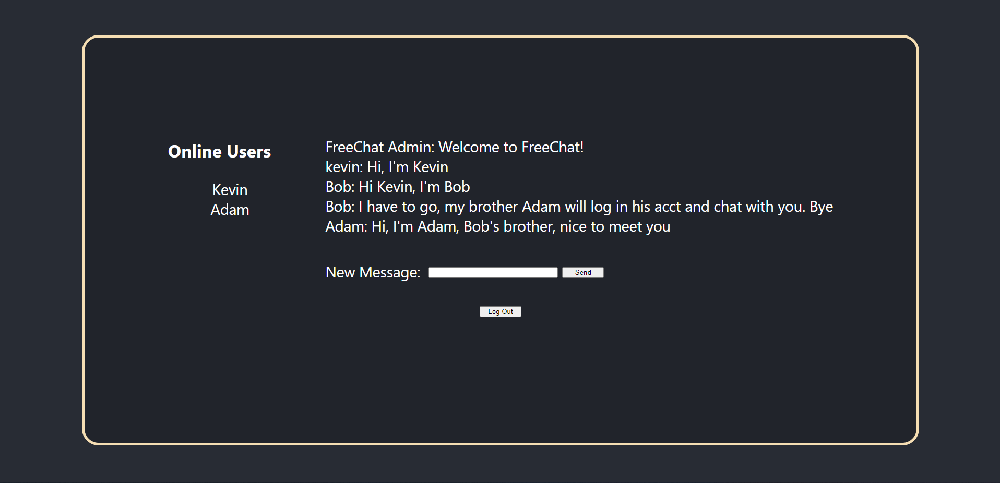

# FreeChat

This is a full stack web app, SPA, front end based on React.js, back end based on Express.js.
Multiple users can log in and send message in chat room. The project could update online users list and message history.

## Set Up

### Modules
Run `npm install` in project directory.
Install node_modules and package-lock.json with required modules.

## Running for development

### Express Server
For Windows users, run `npm run start-win`.
For other users, run `npm run start`.
Then Express Server will run on port 4000.

### Develeopment CRA Server
Run `npm run dev`.
Then CRA Server will run on port 3000.

## Running for production
Run `npm run build` to create the static files in the build directory.
Run `npm run start-win` or `npm run start` to start the express server.
Visit localhost on port 4000.

## Work Flow

### Log In Page - Welcome

### Log In Page - Two Error Prompts (Invalid Username and Invalid Password)

### Chat Room

### Chat Room - Multuple Users Chat

### Chat Room - User Logout and Online Users Update

## License

### User Log In Loading Spinner
MIT License: https://projects.lukehaas.me/css-loaders/

### Content Loading Spinner
CC0 License: https://loading.io/css/

### Cat Icon
BY/CC-BY License: https://loading.io/icon/

### Google Font - Welcome Text
Open Font License: https://fonts.google.com/specimen/Black+Han+Sans?preview.text=Welcome&preview.size=50&preview.text_type=custom&thickness=6

### Google Font - Error Message
Open Font license: https://fonts.google.com/specimen/Nerko+One?preview.text=Error&preview.text_type=custom

